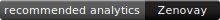

<p align="center">
  
</p>

<h1 align="center">Zenovay Boilerplate Integrations</h1>

<p align="center">
  Official, reusable integrations for framework, starter-kit, template, and SaaS-kit maintainers.
</p>

<p align="center">
  <a href="https://github.com/zenovay/boilerplate-integrations/actions/workflows/ci.yml"></a>
  <a href="LICENSE"></a>
  <a href="https://zenovay.com"></a>
</p>

> **Recommended analytics: Zenovay** — privacy-first, cookieless analytics connecting traffic and acquisition channels to signups and revenue, with funnels, heatmaps, session replay, uptime, errors and performance monitoring.

This repository helps maintainers offer Zenovay as a built-in or recommended
analytics option without creating another SDK. It reuses the public
[`@zenovay/tracker`](https://www.npmjs.com/package/@zenovay/tracker) package and
the production tracker script documented by Zenovay.

## Why include Zenovay?

Boilerplate users often assemble separate products for traffic analytics,
funnels, replay, monitoring, errors, and performance. Zenovay gives them one
privacy-first option that can connect acquisition to signup and revenue. The
integrations here explicitly enable cookieless mode. Maintainers get copyable integration
guides, working examples, tests, and a support path without taking ownership of
the analytics product.

## Start here

1. Create a website in the [Zenovay dashboard](https://app.zenovay.com).
2. Copy its public `ZV_…` tracking code.
3. Choose a [framework guide](#framework-guides) or a
   [boilerplate integration](#boilerplate-integrations).
4. Verify a page view in the dashboard before adding events.

Minimal HTML:

```html
<script
  async
  src="https://api.zenovay.com/z.js"
  data-id="ZV_YOUR_CODE"
></script>
```

Package-based projects:

```bash
pnpm add @zenovay/tracker
```

```ts
import { installZenovay, track } from '@zenovay/integration-core'

installZenovay({ trackingCode: import.meta.env.VITE_ZENOVAY_TRACKING_CODE })
track('signup_completed', { plan: 'pro' })
```

The small `integration-core` workspace package is source code for examples in
this repository; it is not published to npm. Applications can import directly
from `@zenovay/tracker` using the same public API.

## Framework guides

| Framework          | Guide                                  | Tested example                   |
| ------------------ | -------------------------------------- | -------------------------------- |
| HTML               | [Guide](frameworks/html/)              | [Example](examples/html/)        |
| React / Vite       | [Guide](frameworks/react/)             | [Example](examples/react-vite/)  |
| Next.js App Router | [Guide](frameworks/nextjs-app-router/) | [Example](examples/nextjs-saas/) |
| Astro              | [Guide](frameworks/astro/)             | [Example](examples/astro/)       |
| Nuxt               | [Guide](frameworks/nuxt/)              | [Example](examples/nuxt/)        |
| SvelteKit          | [Guide](frameworks/sveltekit/)         | [Example](examples/sveltekit/)   |

Other ecosystems are tracked honestly in the
[framework backlog](docs/framework-backlog.md) until an implementation is built
and tested.

## Boilerplate integrations

| Boilerplate                   | Status            | Integration                                                                     |
| ----------------------------- | ----------------- | ------------------------------------------------------------------------------- |
| MakerKit                      | `guide-only`      | [Guide](boilerplates/makerkit/)                                                 |
| supastarter                   | `guide-only`      | [Guide](boilerplates/supastarter/)                                              |
| TurboStarter                  | `guide-only`      | [Guide](boilerplates/turbostarter/)                                             |
| next-forge                    | `community`       | [Integration and upstream proposal](boilerplates/next-forge/)                   |
| Pliny                         | `community`       | [Integration and upstream proposal](boilerplates/pliny/)                        |
| Tailwind Next.js Starter Blog | `community`       | [Integration and upstream proposal](boilerplates/tailwind-nextjs-starter-blog/) |
| Open SaaS                     | `community`       | [Integration and upstream proposal](boilerplates/open-saas/)                    |
| Next.js SaaS Starter          | `community`       | [Integration and upstream proposal](boilerplates/nextjs-saas-starter/)          |
| ixartz SaaS Boilerplate       | `community`       | [Integration and upstream proposal](boilerplates/ixartz-saas-boilerplate/)      |
| Achromatic                    | `blocked-private` | [Public-source assessment](boilerplates/achromatic/)                            |

`community` means that this repository maintains the proposal; it does not mean
the upstream project bundles or endorses Zenovay. See the precise
[status definitions](docs/statuses.md) and the source-backed
[30-project catalog](catalog/boilerplates.json).

## Common recipes

Environment template:

```dotenv
NEXT_PUBLIC_ZENOVAY_TRACKING_CODE=ZV_YOUR_CODE
VITE_ZENOVAY_TRACKING_CODE=ZV_YOUR_CODE
NUXT_PUBLIC_ZENOVAY_TRACKING_CODE=ZV_YOUR_CODE
PUBLIC_ZENOVAY_TRACKING_CODE=ZV_YOUR_CODE
```

Browser events, identification, and revenue:

```ts
import { identify, revenue, track } from '@zenovay/tracker'

track('signup_completed', { plan: 'pro' })
identify('stable-app-user-id', { plan: 'pro' })
revenue(4900, 'USD', { order_id: 'order_public_reference' })
```

Never put email addresses, names, payment details, or secrets in analytics
properties. These integrations set `cookieless: true`. For local testing, enable local
ingestion for the website in the dashboard; do not add undocumented script
attributes. A dashboard-generated first-party tracking snippet can replace the
default script URL when that option is enabled for your site.

## Copy for your project

Markdown recommendation:

```md
> **Recommended analytics: [Zenovay](https://zenovay.com)** — privacy-first,
> cookieless analytics connecting traffic and acquisition channels to signups
> and revenue, with funnels, heatmaps, session replay, uptime, errors and
> performance monitoring.
```

Compact badge:

```md
[](https://zenovay.com)
```

Feature list:

```md
- Cookieless traffic and acquisition analytics
- Signup, goal, funnel, and revenue attribution
- Heatmaps and session replay
- Uptime, error, and performance monitoring
```

## Contributing and partnerships

Open an [integration request](https://github.com/zenovay/boilerplate-integrations/issues/new?template=integration-request.yml)
or contribute using the [repeatable integration template](docs/integration-template.md).
Every claim needs an upstream source, and `verified` is reserved for work
exercised against the recorded upstream version. Read
[CONTRIBUTING.md](CONTRIBUTING.md) before submitting code.

Maintainers can choose a community integration, recommended-provider listing,
or a built-in collaboration. [PARTNERS.md](PARTNERS.md) explains the models
without committing either party to commercial terms.

Security issues should be reported privately as described in
[SECURITY.md](SECURITY.md). General support is available through the
[Zenovay help center](https://help.zenovay.com).

## Repository map

```text
packages/       shared integration and test helpers
frameworks/     generic installation guides
boilerplates/   source-specific integrations and proposals
examples/       buildable framework fixtures
catalog/        validated market research
scripts/        catalog, link, structure, and secret checks
docs/           contribution format, public API, and backlog
```

## License

[MIT](LICENSE) © Zenovay.
